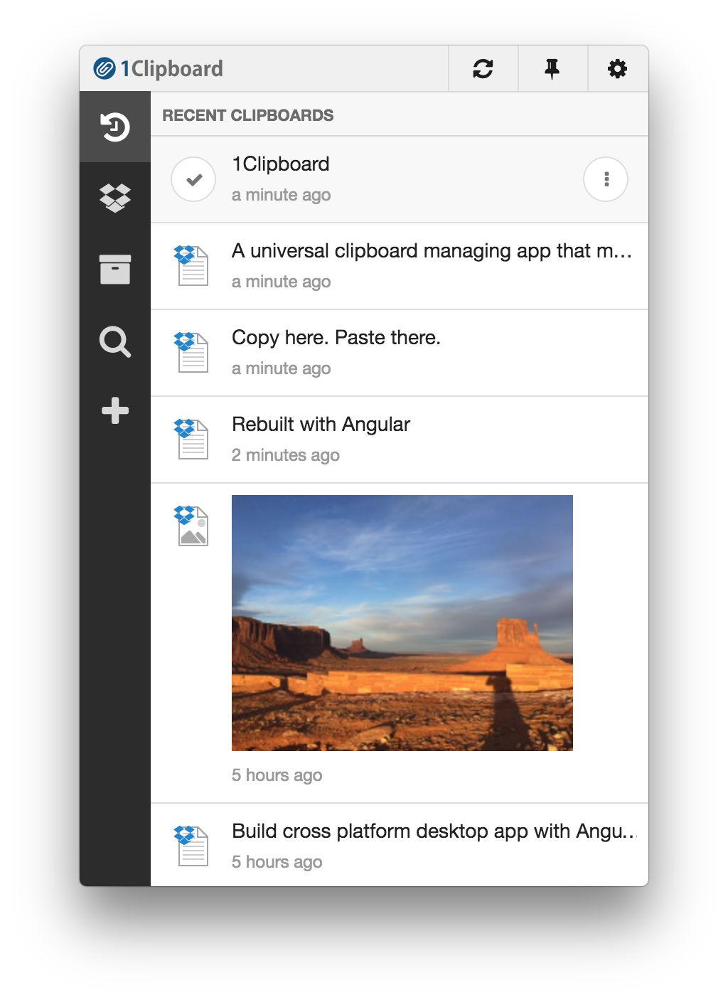

  
  <h1 align="center">1Clipboard</h1>
  
<b>A universal clipboard managing app that makes it easy to access your clipboard from anywhere on any device.</b>

  

# 1Clipboard

**1Clipboard is Electron based modern web application written by Typescript using Angular4 (angular-cli) + ngrx (redux for Angular) + PouchDB.** I can't say this project is the best example, but anyway it is worth to look for those who are going to use Angular framework as their native application. This project is still a work in progress and not yet ready for production.

## Note

I am currently working on this project from scratch with the newer web technology, so the source code is different from the released version.
I am going to open this project as a public repository in the future when it is ready.
If you want to access to the current private repo, please contact me with your github account. 

## Download

You can download the current released version of 1Clipboard for Windows, and macOS from [http://1clipboard.io](http://1clipboard.io).

## Support

If you like this project, you can support me by starring this repository or getting in touch at <contact@1clipboard.io>

## License
MIT © [wiziple](https://github.com/wiziple)
